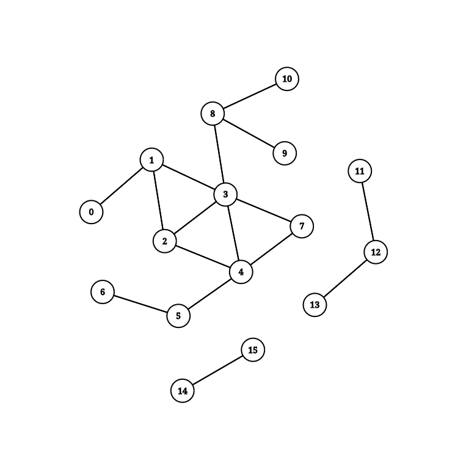

## Instructions
To build the project, you need cmake (>=3.10) and a C++17 compiler. Clone the repository and run the following commands in the project's root directory:
```bash
cmake -B build
cd build
make <target>
```
The make target selects the dataset to use. The available targets are listed in the Datasets section.

## Datasets
| Make target | Dataset           | `\|V\|` | `\|E\|` | Notes          | Source    |
|-------------|-------------------|---------|---------|----------------|-----------|
| test        | test              | 11      | 26      | Handcrafted    |           |
| random      | random_1k_5k      | 1000    | 9940    | Small diameter | Speedcode |
| powergrid   | USpowergrid_n4941 | 4942    | 13190   | Small diameter | [^1]      |

## Graphs
The following image represents the test graph.


[^1]: [https://toreopsahl.com/datasets/#uspowergrid).
